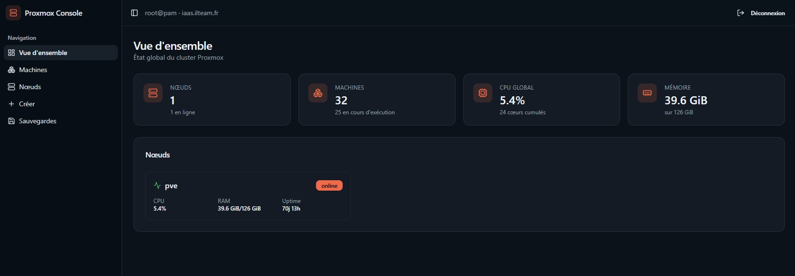
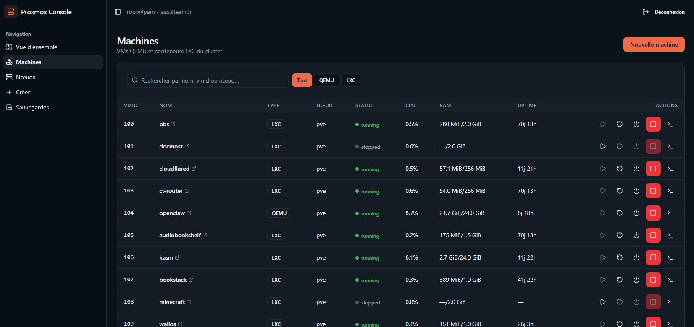
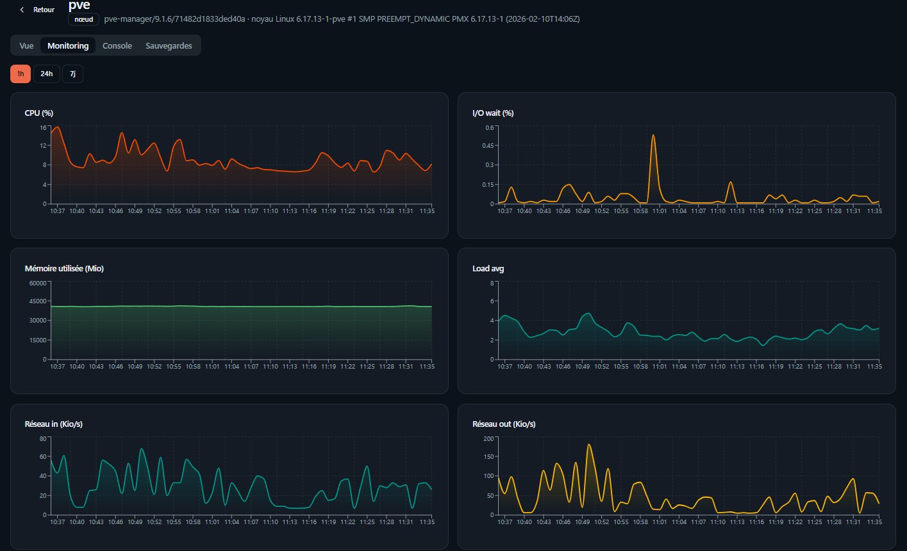
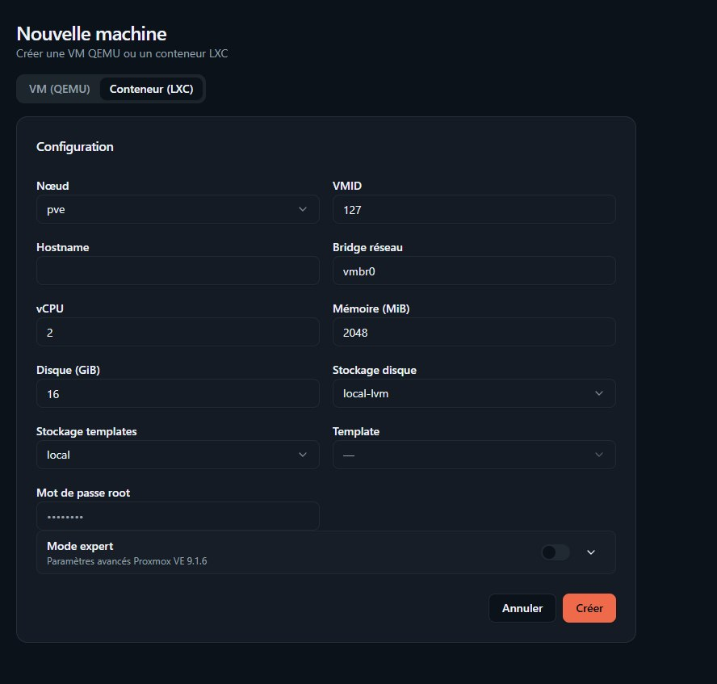
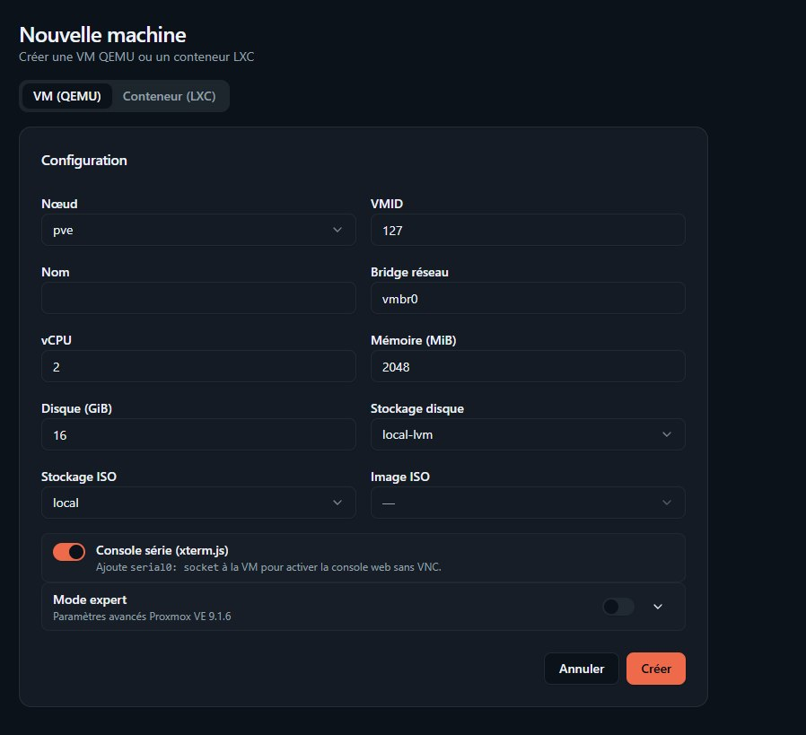
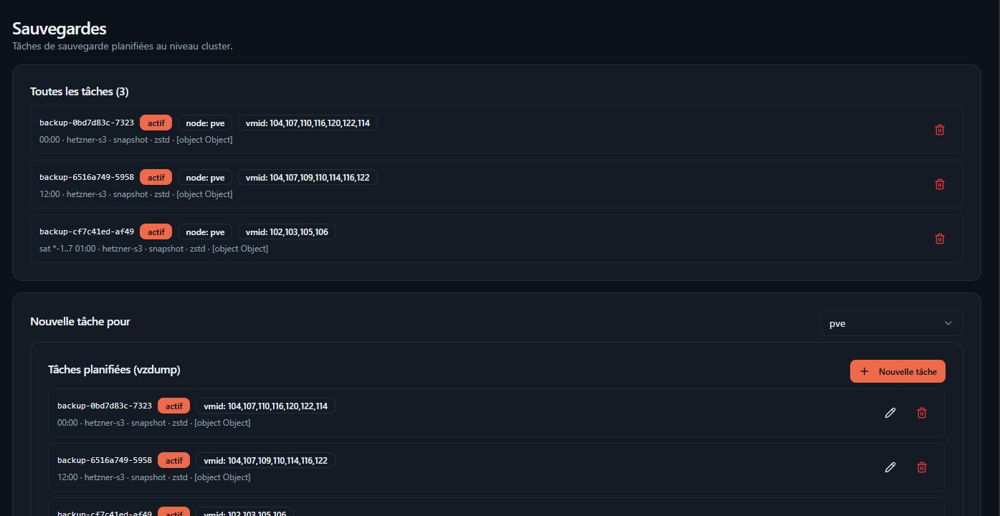

# Proxmox Control Panel

<p align="center">
  <a href="https://github.com/DavyLss/proxmox-control-panel"></a>
  
  
  
</p>

<p align="center">
  <a href="https://github.com/DavyLss/proxmox-control-panel/actions"></a>
  
  
  
</p>

<p align="center">
  <strong>Interface web plus simple et plus rapide pour gérer Proxmox VE.</strong><br/>
  Vois toutes tes VMs, LXC, backups, et monitoring — sans devoir naviguer dans 10 pages.<br/>
  <a href="https://proxmox-control-panel.lassechere.fr/"><strong>Démo en ligne</strong></a>
</p>

---

## Pourquoi ce projet ?

Parce que l’interface native de Proxmox est super complète… mais pour les tâches du quotidien (redémarrer une VM, vérifier un backup, accéder à une console), c’est souvent trop bas niveau et trop dispersé.

J’avais marre de devoir cliquer dans 3 sous‑menus juste pour voir l’état d’une machine, ou de ne pas avoir une vue d’ensemble rapide de tout mon cluster.

Ce que cette interface apporte :
- Une seule page pour voir TOUTES les VMs et LXC, avec actions rapides
- Monitoring en temps réel avec graphiques clairs
- Accès console web en 1 clic
- Vue centralisée des backups et jobs

---

## Fonctionnalités

- **Dashboard** : Vue d’ensemble de la santé de ton cluster (nœuds en ligne, CPU/RAM cumulé, nombre de machines)
- **Inventaire machines** : Toutes tes VMs QEMU et conteneurs LXC sur une seule page, avec filtres et actions rapides (start/stop/reboot/console)
- **Pages nœuds** : Statut détaillé, monitoring avec graphiques CPU/RAM/réseau, console shell du nœud
- **Création de machines** : Wizard pour créer des VMs QEMU ou conteneurs LXC, avec mode simple et expert
- **Gestion backups** : Visualise et gère tes jobs de backup vzdump, lance des backups à la demande
- **Console web** : Accès terminal en 1 clic pour les nœuds et les machines (via xterm.js + WebSocket)

---

## Screenshots

### Dashboard



### Guests list



### Node monitoring



### Create LXC



### Create QEMU VM



### Backups



---

## Quick start

### 1) Clone

```bash
git clone https://github.com/DavyLss/proxmox-control-panel.git
cd proxmox-control-panel
git checkout develop
```

### 2) Run with Docker Compose

```bash
docker compose up -d --build
```

App URL (default): `http://localhost:8080`

### 3) Local dev mode

```bash
npm install
npm run build
npm run start
```

---

## Docker image (GHCR)

Image is published to:

- `ghcr.io/davylss/proxmox-control-panel`

Example compose reference:

```yaml
services:
  proxmox-control-panel:
    image: ghcr.io/davylss/proxmox-control-panel:${IMAGE_TAG:-develop}
    ports:
      - "8080:8080"
```

---

## Deployment model

Recommended target-host pattern:

- clone repo in `/opt/proxmox-control-panel`
- track only `develop`
- update with hard reset
- redeploy with Docker Compose

Example:

```bash
git fetch origin develop
git checkout develop
git reset --hard origin/develop
docker compose pull --ignore-buildable || true
docker compose up -d --build --remove-orphans
```

---

## Proxmox + Cloudflare prerequisites

For stable API + console behavior behind Cloudflare:

1. Proxmox endpoint reachable in HTTPS
2. frontend hostname allowed in `vite.config.ts` (`server.allowedHosts`)
3. CORS headers correctly returned on `/api2/*`
4. WebSocket upgrades preserved for console routes
5. auth ticket/cookie compatibility handled end-to-end

If you route Proxmox through a Cloudflare Worker, ensure it handles:

- preflight (`OPTIONS`)
- origin-aware CORS
- websocket upgrade passthrough
- cookie forwarding/rewriting compatibility for console paths

---

## Authentication notes

- Login uses Proxmox authentication endpoints
- Ticket/session is restored client-side on reload
- Auto-refresh is used to keep sessions valid
- TOTP/recovery support works when Proxmox 2FA is enabled

---

## Tech stack

- **Frontend:** React 19 + TypeScript
- **App framework:** TanStack Start + TanStack Router
- **Build:** Vite
- **UI:** shadcn/ui + Tailwind CSS + Radix UI
- **Charts:** Recharts
- **Container:** Docker
- **Registry:** GHCR

---

## Project structure

```text
src/
  components/            # UI + Proxmox widgets
  lib/proxmox/           # API client, auth, console helpers
  routes/                # TanStack file-based routes
.github/workflows/       # CI workflows
Dockerfile               # Container image build
/docker-compose.yml      # Local/target deployment
vite.config.ts           # Vite + host allowlist
```

---

## Useful commands

```bash
npm install
npm run build
npm run start
npm run lint
npm run format
```

---

## Troubleshooting

### `Failed to fetch` after login

Usually CORS/origin mismatch on Proxmox API routes.

### Console opens but stays blank

Check websocket upgrade path, cookie forwarding, Proxmox permissions, and guest/node running state.

### Public hostname blocked

Add the hostname to `vite.server.allowedHosts` in `vite.config.ts`.

---

## Security recommendations

- Do not commit long-lived credentials/secrets
- Use least-privilege Proxmox accounts/tokens
- Review Cloudflare Worker behavior carefully when handling auth/cookies

---

## Branch policy

- **Default branch:** `develop`
- **Production updates:** from validated commits on `develop`
- **Deleted branch:** `main`

---

## Liens utiles

- **Code source** : https://github.com/DavyLss/proxmox-control-panel
- **Démo** : https://proxmox-control-panel.lassechere.fr/
